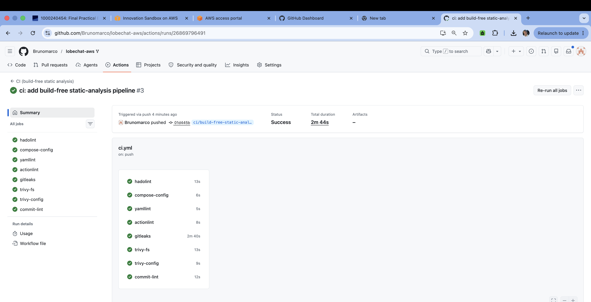

# CI Reasoning — `lobechat-aws` build-free static-analysis pipeline

## Evidence — the workflow actually runs in GitHub Actions

- **Repository:** `Brunomarco/lobechat-aws`
- **Workflow:** `CI (build-free static analysis)` (`.github/workflows/ci.yml`)
- **Actions run URL:** `<<RUN_URL>>`
- **Commit SHA the run executed against:** `<<RUN_SHA>>`
- **Branch:** `ci/build-free-static-analysis`

The screenshot shows my own repository/owner, the run, the list of jobs (`hadolint`,
`compose-config`, `yamllint`, `actionlint`, `gitleaks`, `trivy-fs`, `trivy-config`,
`commit-lint`) each with its conclusion, and the run's commit + timestamp. No gate was
deleted to obtain green: the warn-only gates (`hadolint`, `gitleaks`, `trivy-fs`,
`trivy-config`) still execute and surface their findings in the logs — they simply do
not gate the run (`continue-on-error: true`), a documented design choice (see below).

---

## Part A — Why what I did matters (repository-specific)

Every claim below is anchored to a real file + line in this fork.

### 1. `hadolint` on **both** Dockerfiles — `dockerfiles/mcphub.Dockerfile` & `dockerfiles/sandbox.Dockerfile`
- **`dockerfiles/mcphub.Dockerfile:1` `FROM samanhappy/mcphub:latest`** — the base image is
  pulled by a floating `:latest` tag, so two builds weeks apart can produce different
  images with no record of what changed. hadolint flags this (DL3007). This is the
  **real unpinned-pull risk** in the repo: the compose `mcphub` *service*
  (`docker-compose.yml:76-80`) is **built locally** to `lobechat-aws-mcphub:latest`, so
  the supply-chain exposure lives in the Dockerfile `FROM`, not in a pulled compose image.
- **`dockerfiles/mcphub.Dockerfile:5` `USER root`** plus **`:7`** installing `gcc` and
  `docker.io` into a *runtime* image — hadolint surfaces the bloated/over-privileged
  runtime; a compromised MCP process now has a compiler and the Docker client in-image.
- **`dockerfiles/sandbox.Dockerfile:21` `echo 'oriol ALL=(ALL) NOPASSWD:ALL'`** grants
  passwordless root, and **`:42-45` / `:48-53` / `:56-65`** download `kubectl`, `eksctl`
  and `zellij` from `latest`/`stable.txt` URLs **with no version pin or checksum** — a
  classic unverified-binary supply-chain hole. hadolint catching these on every push is
  exactly the point.

### 2. `trivy config` (misconfiguration) over the Dockerfiles + Compose
- Detects the same root/`:latest`/no-healthcheck patterns as IaC misconfigurations,
  e.g. `docker-compose.yml:109` `qdrant/qdrant:latest` and `:185` `minio/minio:latest`
  (unpinned), and `dockerfiles/mcphub.Dockerfile:5` running as root. This is the
  config-as-data complement to hadolint's Dockerfile-syntax view.

### 3. `docker compose config -q` (schema + interpolation, **never** `up`/`build`)
- The 238-line `docker-compose.yml` mounts a host path with bracket-heavy syntax at
  **`docker-compose.yml:27`**
  (`./patches/route.js:/app/.next/server/app/(backend)/trpc/tools/[trpc]/route.js:ro`)
  and interpolates ~15 `${VAR}` values. `config -q` statically catches a malformed
  mount, a typo'd anchor, or an unresolvable variable **before** anyone tries to deploy —
  without ever starting the GPU/11-service stack.

### 4. `gitleaks` over working tree + history
- The stack passes real secrets as **plaintext env vars** — `NEXT_AUTH_SECRET`
  (`docker-compose.yml:35`), `KEY_VAULTS_SECRET` (`:53`), `OPENROUTER_API_KEY` (`:55`),
  `HF_TOKEN` (`:157`), and the `SSH_*` block (`:85-92`) — and bind-mounts host AWS
  credentials at **`docker-compose.yml:103`** (`~/.aws:/root/.aws:ro`). One careless
  `git add` of a populated `.env` or an `id_rsa` would leak production keys. gitleaks
  enforces, on every push, that the `.gitignore` discipline (below) actually holds.

### 5. `uv run cz check` — Conventional Commits, the repo's existing local gate
- The repo already gates commits locally via **`.githooks/commit-msg`** (which runs
  `uv run cz check --commit-msg-file "$1"`) and ships a **`[tool.commitizen]`** block in
  **`pyproject.toml:17-25`** with `tag_format = "v$version"` and
  `update_changelog_on_bump = true`. Versioning/changelog automation (`cz bump`) only
  works if commit messages stay conventional, so CI mirrors the local hook. I bound the
  check to this push's commit (`-m "$(git log -1 --pretty=%B)"`) because the
  `--commit-msg-file` path the hook uses does not exist in CI and an unbounded check
  would go red on the repo's pre-existing non-conventional history.

### 6. `yamllint` + `actionlint`
- `yamllint` parses `docker-compose.yml` and `ci.yml` for structural YAML errors;
  `actionlint` validates `.github/workflows/ci.yml` itself (job/step schema, expression
  syntax, runner labels) so a broken pipeline fails fast instead of silently mis-running.

### Why the pipeline is **build-free**
The stack cannot run on a standard GitHub runner. The **`vllm`** service
(`docker-compose.yml:151-182`) reserves an **NVIDIA GPU** (`:169-175`,
`driver: nvidia`) and declares **`start_period: 300s`** (`:182`) on its healthcheck —
GitHub-hosted runners have no GPU. On top of that, `lobe-chat` (`:66-74`) `depends_on`
`postgres`, `casdoor`, `minio` and `vllm` being healthy, so the whole 11-service graph
would have to come up. Therefore the pipeline runs **only static gates** — no
`docker build`, no `docker compose up`/`run`, no deploy.

### Why `tests/` are excluded
`tests/` are **live-stack integration tests**, not unit tests. For example
**`tests/test_vllm.py:9-11`** imports `httpx` and `openai`, and **`:13`** targets
`http://localhost:47007/v1`, hitting a running vLLM `/health` endpoint. The other suites
(`test_mcp_ssh.py`, `test_mcp_minio.py`, `test_mcp_aws_resources.py`,
`test_mcp_playwright.py`, `test_session_rebuild.py`) likewise require live MCP/MinIO/SSH
endpoints. With no stack running, invoking `pytest` would only produce connection errors —
so the workflow deliberately never calls it.

### Why the Compose-interpolation fix is safe
`docker compose config` needs values for the undefined `${VAR}` secrets, so the job does
`cp .env.example .env` and appends a dummy `OPENAPI_MCP_HEADERS` (the one variable absent
from `.env.example`). This commits **no real secrets**: `.env.example` is checked in and
self-describes its values as *"Not real secrets, just for test"* (`.env.example:3`), and
**`.gitignore:8`** already ignores `.env`, so the copy is never committed. I make **no
claim** that gitleaks found committed secrets — it should not: `.gitignore` also excludes
`aws_credentials.yaml` (`:19`), `*.pem` (`:20`) and `config/ssh/` (`:26`), so on a clean
tree the secret scan correctly finds nothing.

---

## Part B — What is missing for a real production CI/CD (delivery) pipeline

**What I built is Continuous Integration only** — static quality/security gates that run
on every push/PR and assert the repository is well-formed and free of obvious
supply-chain/secret/hardening regressions. It **stops short of Continuous
Delivery/Deployment**: nothing here builds an artifact, publishes it, promotes it through
environments, or deploys it to a server. Below are the concrete additions a real
production pipeline for *this* system must make, each grounded in this fork.

1. **Build, push, sign & SBOM the locally-built images, and pin everything to digests.**
   The two images that are built from source — `dockerfiles/mcphub.Dockerfile` and
   `dockerfiles/sandbox.Dockerfile` (referenced at `docker-compose.yml:76-80` and
   `:205-209`) — are never published anywhere; a deploy host would rebuild them ad hoc.
   CD must build them, push to a registry (e.g. ECR), generate an SBOM and a cosign
   signature, and **resolve the floating images to immutable digests**: `lobe-chat`
   (untagged, `docker-compose.yml:21`), `qdrant/qdrant:latest` (`:109`),
   `minio/minio:latest` (`:185`) and the `FROM samanhappy/mcphub:latest`
   (`dockerfiles/mcphub.Dockerfile:1`). Without digests a redeploy is not reproducible.

2. **Federate to AWS via GitHub OIDC instead of long-lived static keys.** Today the
   stack reaches AWS by **bind-mounting host credentials** —
   `~/.aws:/root/.aws:ro` (`docker-compose.yml:103`) — and `.env.example:61-63` carries
   commented `AWS_ACCESS_KEY_ID` / `AWS_SECRET_ACCESS_KEY` / `AWS_SESSION_TOKEN`
   placeholders. A real pipeline assumes a role via OIDC so CI holds **no standing
   credentials** and nothing long-lived is mounted or baked in.

3. **Inject secrets at deploy time from SSM Parameter Store / Secrets Manager.** The
   secrets currently arrive as plaintext env (`NEXT_AUTH_SECRET` `docker-compose.yml:35`,
   `KEY_VAULTS_SECRET` `:53`, `OPENROUTER_API_KEY` `:55`, `HF_TOKEN` `:157`, the `SSH_*`
   block `:85-92`). CD should pull them from a managed store at deploy time and never
   write them to disk or an image layer.

4. **A database migration stage with the destructive path guarded.** The repo ships a
   Flyway toolchain — `db/flyway/provision.sh` with per-DB migrations under
   `db/flyway/{casdoor,litellm,lobechat}/`. The **`clean` target drops all data**
   (`db/flyway/provision.sh:10`, run via `-cleanDisabled=false clean` at `:68-71`); a
   production pipeline must run `migrate` automatically but place `clean` behind an
   explicit manual approval so it can never fire on prod.

5. **Environment promotion dev → stage → prod with protected environments / manual
   approval.** There is no notion of environments anywhere in the repo; a single
   `docker-compose.yml` is the whole deployment. CD needs GitHub Environments with
   required reviewers so a change is promoted, not pushed straight to prod.

6. **A real deploy mechanism that keeps the app port closed.** Deploying to the target
   (a single EC2 host today) via SSM Run Command / `compose pull && up -d` must keep
   `LOBECHAT_PORT` 47000 (`docker-compose.yml:24`) closed behind the reverse proxy
   rather than exposed directly.

7. **Post-deploy smoke + health gates.** Several services have **no healthcheck** —
   `casdoor`, `lobe-chat`, `mcphub`, `hayhooks-mcp`, `linux-sandbox` — so a deploy can
   "succeed" with a dead app. CD should add health gating and run the live `tests/`
   (e.g. `tests/test_vllm.py` `/health`) against an **ephemeral** environment before
   promoting.

8. **Automated rollback over an immutable unit.** The current deploy unit is an
   **unpinned image plus a bind-mounted monkeypatch** — `./patches/route.js` mounted over
   the app at `docker-compose.yml:27`. That is not rollback-able. A real pipeline bakes
   `patches/route.js` into a **forked, pinned** lobe-chat image and rolls back by
   re-pointing to the previous digest.

9. **Branch protection, required status checks, and signed release tags.** These CI gates
   should be **required** before merge, and releases cut as signed tags via `cz bump`
   (the `tag_format = "v$version"` machinery in `pyproject.toml:23`).

### Prioritisation — the single highest-value next step

**Stand up a registry and make every image an immutable, digest-pinned artifact —
building/pushing `mcphub.Dockerfile` and `sandbox.Dockerfile` and resolving the
`:latest`/untagged images (`docker-compose.yml:21,109,185`,
`dockerfiles/mcphub.Dockerfile:1`) to digests.** This is the foundation everything else
in CD depends on: you cannot *promote*, *roll back*, or run *smoke tests against a known
build* if there is no addressable, reproducible artifact to point at — today a redeploy
can silently pull a different upstream image. Pinned, published images turn "it works on
the host that happened to build it" into a deterministic unit that the promotion,
rollback and approval stages above can then safely operate on.
